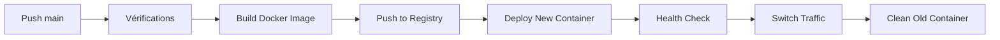

# So-Close Project

Ce projet fait partie du cours SOCRA d'EPITA SIGL 2026.

## Description

So-Close est une application web moderne visant à simplifier la gestion des tâches quotidiennes, déployée avec une architecture Docker moderne et un système de déploiement zero-downtime.

## 🚀 Déploiement Automatique avec Docker

Le site est **automatiquement containerisé et déployé** via GitHub Actions avec une stratégie **Blue-Green Deployment** pour garantir **zéro interruption de service**.

**Site en ligne :** [https://so-close.groupe28.socra-sigl.fr](https://so-close.groupe28.socra-sigl.fr)

### 🐳 Architecture Docker

Notre application utilise :
- **Container Runtime** : Docker avec Nginx Alpine
- **Registry** : GitHub Container Registry (`ghcr.io`)
- **Déploiement** : Blue-Green avec rotation automatique
- **SSL/TLS** : Let's Encrypt avec renouvellement automatique
- **Monitoring** : Health checks intégrés

### 🎯 Pipeline CI/CD Complet

Notre pipeline GitHub Actions inclut :
- ✅ **Vérification Markdown** (markdownlint)
- ✅ **Build Docker** avec cache optimisé
- ✅ **Push vers GitHub Container Registry**
- ✅ **Déploiement Zero-Downtime** (Blue-Green)
- ✅ **Préservation SSL** Let's Encrypt automatique
- ✅ **Tests de santé** du site après déploiement
- ✅ **Rollback automatique** en cas d'échec
- ✅ **Résumé détaillé** de chaque déploiement
- ✅ **Nettoyage automatique** des anciennes images

### ⚡ Zero-Downtime Deployment

Notre système utilise une stratégie **Blue-Green** :

1. **Container Bleu** (production) sert le trafic
2. **Container Vert** est déployé avec la nouvelle version
3. **Test de santé** sur le nouveau container
4. **Basculement instantané** du proxy Nginx
5. **Arrêt** de l'ancien container

**Résultat :** 🎯 **0 seconde d'interruption** lors des déploiements !

### 🏗️ Workflow de Déploiement Complet

1. **Push** vers `main` → Déclenchement automatique
2. **Vérifications** (Markdown, structure fichiers)
3. **Build** de l'image Docker avec cache
4. **Push** vers GitHub Container Registry
5. **Déploiement Blue-Green** sur le serveur
6. **Tests de santé** et validation
7. **Basculement** du trafic zero-downtime
8. **Nettoyage** et résumé



## 🛠️ Configuration Docker

### 📁 Structure avec Docker

```
so-close/
├── index.html              # Page principale
├── README.md               # Documentation
├── Dockerfile              # Configuration Docker
├── .dockerignore           # Exclusions Docker
├── docker-compose.yml      # Développement local
├── .github/
│   └── workflows/
│       └── deploy.yml      # Pipeline CI/CD Docker
└── docs/                   # Documentation additionnelle
```

### 🐳 Dockerfile

```dockerfile
FROM nginx:alpine
LABEL maintainer="Caron Anthony & Jolivalt Guillaume"
LABEL description="So-Close Project - SOCRA SIGL 2026"

COPY index.html /usr/share/nginx/html/
EXPOSE 80

HEALTHCHECK --interval=30s --timeout=3s --start-period=5s --retries=3 \
  CMD wget --no-verbose --tries=1 --spider http://localhost/ || exit 1
```

## 🛠️ Configuration Manuelle (pour référence)

### 1. Se connecter au serveur

```bash
ssh -i <chemin_vers_votre_cle_privee> sigl@so-close.groupe28.socra-sigl.fr
```

### 2. Installer Nginx

```bash
sudo apt update
sudo apt install nginx -y
sudo systemctl enable nginx
sudo systemctl start nginx
```

### 3. Configuration Nginx

Le serveur utilise la configuration automatique via le pipeline Docker, mais la configuration manuelle de base utilise les fichiers dans `/var/www/html/`.

### 4. HTTPS avec Let's Encrypt

```bash
sudo apt install certbot python3-certbot-nginx -y
sudo certbot --nginx -d so-close.groupe28.socra-sigl.fr
```

**Note :** Le pipeline Docker préserve automatiquement cette configuration SSL lors des déploiements.

## 🔧 Développement Local

### Prérequis

- Un navigateur web moderne
- Docker (pour la containerisation) OU un serveur web local

### Lancer en local

```bash
# Option 1: Docker (recommandé pour reproduire la production)
docker build -t so-close:local .
docker run -p 8080:80 so-close:local

# Option 2: Docker Compose
docker-compose up

# Option 3: Serveur Python simple
python3 -m http.server 8000

# Option 4: Serveur Node.js
npx serve .

# Option 5: Ouvrir directement index.html dans le navigateur
```

### 🧪 Test du Déploiement Zero-Downtime

```bash
# Monitoring en continu pendant déploiement
while true; do
  echo "$(date '+%H:%M:%S') - $(curl -s -o /dev/null -w "%{http_code}" https://so-close.groupe28.socra-sigl.fr)"
  sleep 1
done
```

## 🔒 Configuration SSL/TLS

### Let's Encrypt avec Certbot

```bash
# Installation (une seule fois)
sudo apt install certbot python3-certbot-nginx -y
sudo certbot --nginx -d so-close.groupe28.socra-sigl.fr

# Renouvellement automatique
sudo certbot renew --dry-run
```

**Note :** Le pipeline Docker préserve automatiquement la configuration SSL lors des déploiements.

## 🔧 Commandes Docker Utiles

```bash
# Build local
docker build -t so-close:test .

# Test local
docker run -p 8080:80 so-close:test

# Voir les containers en production
docker ps --format "table {{.Names}}\t{{.Status}}\t{{.Ports}}"

# Logs des containers
docker logs so-close-blue --tail 50
docker logs so-close-green --tail 50

# Nettoyage
docker system prune -f
```

## 📊 Registry GitHub

Images disponibles sur :
```
ghcr.io/anthony-projet/so-close:latest
ghcr.io/anthony-projet/so-close:main-<sha>
```

## 🚦 Statut du Projet


**Statut :** 🟢 Production avec Docker Zero-Downtime

## 👥 Équipe

- **Caron Anthony** - DevOps & Full-Stack Developer
- **Jolivalt Guillaume** - Full-Stack Developer

## 🔒 Secrets et Configuration

Le projet utilise les secrets GitHub suivants :
- `HOST` : Adresse du serveur de production
- `USER` : Nom d'utilisateur SSH  
- `SSH_KEY` : Clé privée SSH pour l'authentification
- `GITHUB_TOKEN` : Accès au GitHub Container Registry (automatique)

Ces secrets doivent être configurés dans **GitHub Settings > Secrets and variables > Actions** :

## 🎯 Fonctionnalités Avancées

### ✅ Implémenté
- 🐳 **Containerisation Docker**
- 🔄 **Zero-Downtime Deployment**
- 🔒 **HTTPS Let's Encrypt**
- 📊 **GitHub Container Registry**
- 🧪 **Health Checks automatiques**
- 🔄 **Blue-Green Deployment**

---

**Dernière mise à jour :** Juin 2025  
**Version du pipeline :** v3.0 (Docker Zero-Downtime)  
**Statut :** 🟢 Production  
**Container Registry :** GitHub Container Registry  
**SSL :** Let's Encrypt (Auto-Renewal)  
**Architecture :** Docker + Nginx + Blue-Green Deployment